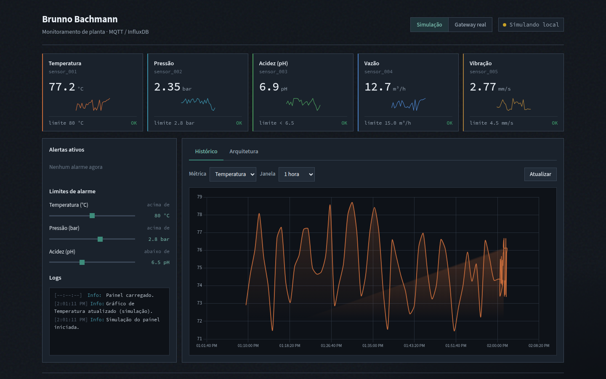

# Industrial IoT Monitoring Platform

[](https://github.com/Brunnobach/industrial-iot-platform/actions/workflows/ci.yml)

Live sensor visibility and threshold alerts for process plants — biogas, manufacturing, and energy operations.

**Result:** operators see temperature, pressure, pH, flow and vibration as they change, and can query the API to flag readings that cross a limit.

**Live plant panel:** [brunnobach.github.io/industrial-iot-platform](https://brunnobach.github.io/industrial-iot-platform/)



---

## Problem

Process plants generate continuous sensor data, but it is often trapped in isolated devices or historian silos. Without a shared live view, operators notice deviations late, and engineers cannot query recent history or apply simple threshold rules from a single place.

## What was built

A local, containerized telemetry stack that:

- Simulates industrial sensors and publishes readings over MQTT
- Ingests those messages into InfluxDB
- Exposes health, latest values, history and threshold checks through FastAPI
- Provisions a Grafana dashboard for plant-floor visualization

The same architecture can be pointed at real MQTT sources on a plant network.

## Architecture

```
simulator  →  MQTT (Mosquitto)  →  ingestion  →  InfluxDB
                                              ↘
                                    FastAPI   →  Grafana
```

| Stage | Role |
|---|---|
| Sensor simulator | Publishes temperature, pressure, pH, flow and vibration |
| Mosquitto | MQTT broker (TCP `1883`, WebSocket `9001`) |
| Ingestion | Subscribes to `factory/sensors/#` and writes points to InfluxDB |
| InfluxDB 2.7 | Time-series store |
| FastAPI | Query API for last values, history and alert checks |
| Grafana 10.4 | Provisioned dashboard (auto-refresh every 5 seconds) |

## Quick start

```bash
git clone https://github.com/Brunnobach/industrial-iot-platform.git
cd industrial-iot-platform
docker compose up -d --build
```

No `.env` file is required. Compose uses the local-development defaults documented in [`.env.example`](.env.example). To override them:

```bash
cp .env.example .env   # then edit passwords / tokens
docker compose up -d --build
```

Wait until the API is healthy (about 20–40 seconds), then open:

| Surface | URL | Notes |
|---|---|---|
| Plant panel | [index.html](index.html) or the [live demo](https://brunnobach.github.io/industrial-iot-platform/) | Browser HMI; connect MQTT WebSocket on `localhost:9001` when the stack is running |
| Grafana | http://localhost:3000 | Default login `admin` / `admin` (anonymous viewer is enabled locally) |
| API docs | http://localhost:8000/docs | OpenAPI |
| MQTT | `localhost:1883` | TCP for MQTT clients, not HTTP |

Stop the stack with `docker compose down`. Add `-v` to drop named volumes.

### Credentials

Passwords and tokens live in environment variables, not in committed Compose values. Defaults are for **local development only** — change them before any shared or production use.

| Variable | Default | Used by |
|---|---|---|
| `INFLUX_ADMIN_USER` | `admin` | InfluxDB setup |
| `INFLUX_ADMIN_PASSWORD` | `adminpassword` | InfluxDB setup |
| `INFLUX_TOKEN` | `iiot-token` | API, ingestion, Grafana |
| `INFLUX_ORG` | `iiot-org` | API, ingestion, Grafana |
| `INFLUX_BUCKET` | `iiot-bucket` | API, ingestion, Grafana |
| `GRAFANA_ADMIN_USER` | `admin` | Grafana |
| `GRAFANA_ADMIN_PASSWORD` | `admin` | Grafana |
| `GRAFANA_ANONYMOUS_ENABLED` | `true` | Grafana (disable outside local demos) |

`.env` is gitignored. `.env.example` is the committed template.

## API examples

| Method | Endpoint | Description |
|---|---|---|
| GET | `/health` | API and InfluxDB health |
| GET | `/sensors/last` | Latest reading per sensor |
| GET | `/sensors/history` | History for one measurement |
| POST | `/alerts/check` | Mean value vs threshold over the last 5 minutes |
| GET | `/measurements` | Distinct measurement names |

```bash
curl http://localhost:8000/health

curl http://localhost:8000/sensors/last

curl "http://localhost:8000/sensors/history?measurement=temperature&minutes=10"

curl -X POST http://localhost:8000/alerts/check \
  -H "Content-Type: application/json" \
  -d '{"measurement": "temperature", "threshold": 80, "operator": "above"}'
```

A `breach` in the alert response means the 5-minute mean crossed the threshold.

## Stack

- Python 3.12, FastAPI, Paho MQTT
- InfluxDB 2.7, Eclipse Mosquitto 2.0, Grafana 10.4
- Docker Compose, Pytest, GitHub Actions, GitHub Pages

## Tests and CI

```bash
pip install -r requirements.txt
pytest
```

GitHub Actions runs unit tests, builds the image, and starts the Compose stack to check `/health`. The Pages deploy job runs only on pushes to `main` (it cannot run on pull requests because GitHub Pages deployments are tied to the default branch).

## Author

[Brunno Bachmann](https://www.linkedin.com/in/brunno-bachmann-865429173) — bioprocess engineer and Python developer. Built for plant monitoring use cases such as biogas and manufacturing.

## License

MIT
